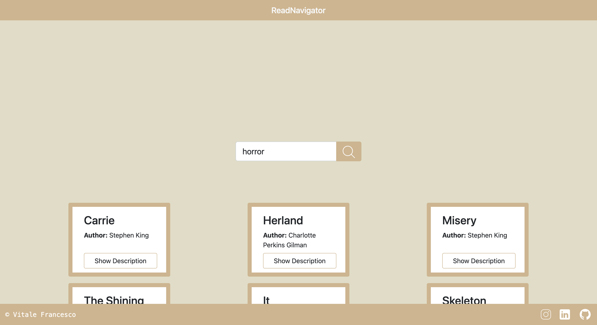

# ReadNavigator

## Explore Books with ReadNavigator

[](https://cdn.jsdelivr.net/npm/sweetalert2@11.0.20/dist/sweetalert2.min.js)
[](https://cdn.jsdelivr.net/npm/bootstrap@5.3.2/dist/js/bootstrap.min.js)

- [Overview](#overview)
- [Features](#features)
- [How To Use](#how-to-use)
- [Credits](#credits)

## Overview

ReadNavigator is a web application that allows you to explore books based on genres using the Open Library API. It provides a user-friendly interface to search for books and view details results.



**Live Demo**: [ReadNavigator](https://readnavigator.netlify.app/)

## Features

- Search for books by genre
- Responsive design for seamless use on various devices
- Integration with Sweetalert2 for enhanced user experience
- Utilizes Bootstrap for a modern and clean UI

## How To Use

To use ReadNavigator, follow these steps:

1. Clone this repository:

    ```bash
    git clone https://github.com/francescovitale-dev/readnavigator.git
    ```

2. Open the `index.html` file in your web browser.

3. Enter a genre in the search bar and click the search button to explore books.

## Credits

ReadNavigator utilizes the following technologies, languages, and libraries:

- [HTML](https://developer.mozilla.org/en-US/docs/Web/HTML)
- [CSS](https://developer.mozilla.org/en-US/docs/Web/CSS)
- [Bootstrap](https://getbootstrap.com/)
- [JavaScript](https://developer.mozilla.org/en-US/docs/Web/JavaScript)
- [Sweetalert2](https://sweetalert2.github.io/)

---

> [vitalefrancesco.com](https://www.vitalefrancesco.com) &nbsp;&middot;&nbsp;
> GitHub [@francescovitale-dev](https://github.com/francescovitale-dev)
